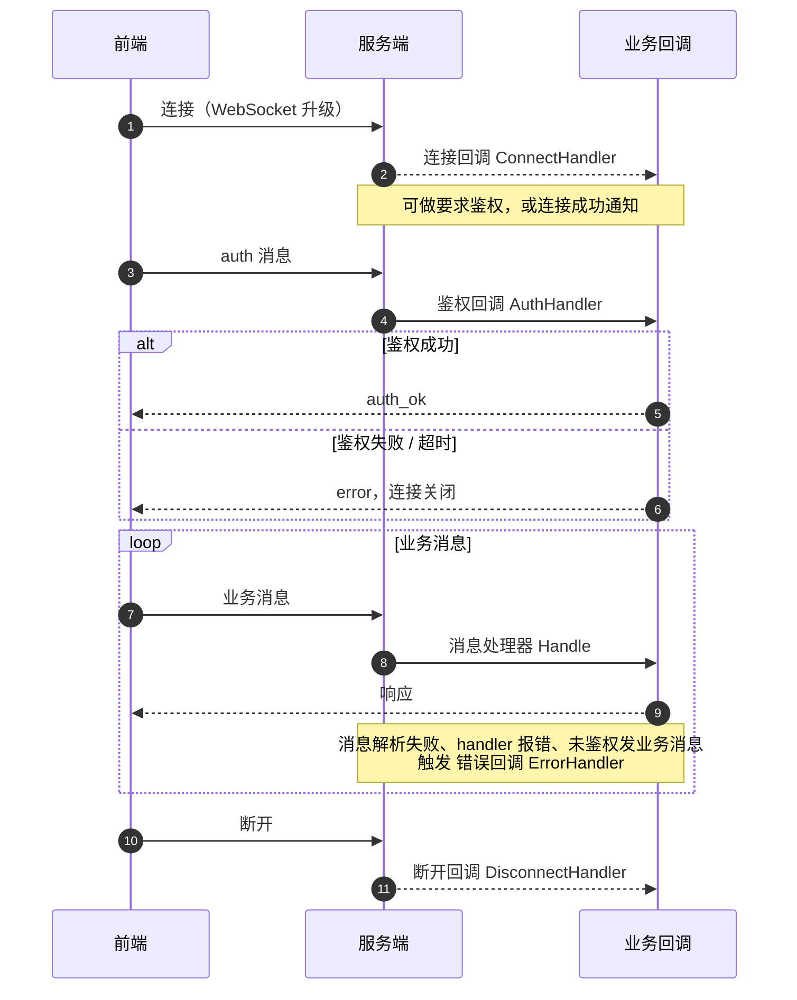

# WebSocket 框架使用文档

基于 Go 的通用 WebSocket 框架，提供连接管理、消息路由与处理机制，仅依赖 `gorilla/websocket` 与标准库。完整可运行示例见 `example/` 目录。

## 特性与优点

- **零框架绑定**：实现标准 `http.Handler`，可直接挂在 `net/http`、Gin、Echo 等任意 HTTP 框架。
- **内建强制鉴权**：连接须在 `AuthTimeout` 内完成鉴权，超时踢线；未鉴权连接拒绝一切业务消息；重复鉴权幂等处理。
- **连接即分配 UUID**：无需鉴权处理器也有唯一 ID，鉴权处理器可返回业务 ID 覆盖。
- **无锁并发模型**：Hub 由单 goroutine 串行消费所有事件，内部状态无锁、无竞态；连接/断开回调自动在独立 goroutine 执行，回调内可安全调用任意 Hub 方法，无死锁。
- **背压由 ctx 控制**：发送队列满时阻塞等待，`context.Context` 决定最长等待时间，调用方握有完全控制权。
- **同步/异步双版本**：`SendToClient` 等待投递结果；`SendToClientAsync` 仅等入队，吞吐优先。
- **O(1) 定向投递**：按客户端 ID 直查映射表，同一用户多连接（多标签页）天然支持。
- **内建分组（房间）**：`JoinGroup`/`SendToGroup` 组内寻址，断开自动清组，慢连接跳过语义与全局广播一致，全程无锁。
- **协议层心跳**：Ping/Pong + 读超时自动剔除死连接，任意入站消息均刷新活跃状态，对业务透明。
- **慢连接保护**：广播跳过发送队列积压的慢连接并记录告警日志，不剔除连接，不影响整体广播。
- **关闭竞态免疫**：内部通道永不 close，关闭信号统一走 `closeCh` + ctx，杜绝 send-on-closed-channel panic；`Close()` 幂等。
- **业务上下文透出**：客户端级元数据存取，保留升级时的原始 `*http.Request`。
- **未知消息兜底**：默认处理器自动回送友好错误。
- **测试完备**：单元测试（含 `-race` 并发用例）、基准测试、可运行示例（含 HTML 客户端）。

## 快速开始

```go
package main

import (
    "context"
    "fmt"
    "net/http"

    "github.com/ixugo/goddd/pkg/ws"
)

func main() {
    hub := ws.NewHub()
    defer hub.Close()

    // 鉴权：验证 auth 消息，返回业务 ID
    hub.SetAuthHandler(func(message ws.Message) (string, error) {
        token, ok := message.Data()["token"].(string)
        if !ok || token != "secret" {
            return "", fmt.Errorf("鉴权失败")
        }
        return "user_001", nil
    })

    // 注册消息处理器
    hub.RegisterHandler("echo", ws.HandlerFunc(func(client *ws.Client, message ws.Message) error {
        return client.Send(context.Background(), ws.NewMessage("echo", message.Data()))
    }))

    http.Handle("/ws", hub)
    http.ListenAndServe(":8080", nil)
}
```

## 消息协议

信封仅两字段：`type` 路由键 + `data` 业务数据。

```json
// 客户端鉴权
{"type": "auth", "data": {"token": "secret"}}

// 服务端响应（成功 / 失败）
{"type": "auth_ok"}
{"type": "error", "msg": "鉴权失败"}

// 业务消息
{"type": "echo", "data": {"content": "hello"}}
```

## 回调一览

所有回调通过 `hub.SetXxxHandler` 注册；除鉴权回调外均在**独立 goroutine** 中执行，内部可安全调用任意 Hub 方法。

| 回调 | 签名 | 触发时机 | 设置方法 |
|---|---|---|---|
| 鉴权回调 | `func(message Message) (clientID string, err error)` | 收到 `auth` 消息时；返回业务 ID 即鉴权成功，返回 error 即失败。ID 必须唯一标识业务主体（不同主体共用 ID 会导致串号投递）；返回空 ID 保留 UUID | `SetAuthHandler` |
| 连接回调 | `func(client *Client) error` | 新连接注册到 Hub 后 | `SetConnectHandler` |
| 断开回调 | `func(client *Client, err error)` | 连接从 Hub 除名后 | `SetDisconnectHandler` |
| 错误回调 | `func(client *Client, err error)` | 消息解析失败、handler 报错、未鉴权发业务消息等 | `SetErrorHandler` |
| 消息处理器 | `func(client *Client, message Message) error` | 收到对应 `type` 的业务消息 | `RegisterHandler(type, handler)` |
| 默认处理器 | 同上 | 收到未注册 `type` 的消息 | `SetDefaultHandler` |

### 连接回调的适用场景

连接回调触发时连接尚未鉴权（ID 为 UUID），且与鉴权回调异步执行、无先后顺序，因此只适合与业务身份无关的动作：

- **服务端主动首推**：连接一建立就推送鉴权质询或欢迎语，无需等客户端先开口；
- 原始连接尝试的度量与日志（含永不鉴权的失败连接）；
- 只依赖 `*http.Request` 的初始化（读取 IP、Header 存入元数据）。

依赖业务 ID 的初始化请放在鉴权回调或首条业务消息处理器中。

```go
// 服务端主动发起鉴权质询：客户端收到后应回送 auth 消息
hub.SetConnectHandler(func(client *ws.Client) error {
    return client.Send(context.Background(), ws.NewMessage("auth_required", nil))
})
```

## 回调时序图

从前端连接到鉴权、业务消息、断开，各回调的触发时机：



要点：鉴权回调与消息处理器同步执行（保序）；连接/断开回调异步执行（回调内可安全调用任意 Hub 方法）。

## Hub 常用方法

| 方法 | 用途 |
|---|---|
| `NewHub(opts...)` | 创建 Hub，可用 `func(*Config)` 覆写配置 |
| `ServeHTTP` | `http.Handler` 实现，直接挂路由处理 WebSocket 升级 |
| `Broadcast(message)` | 向所有已认证客户端广播（队列满的慢连接跳过并记日志） |
| `SendToClient(ctx, id, message)` | 定向发送，等待投递结果，ctx 控制超时 |
| `SendToClientAsync(ctx, id, message)` | 定向发送，仅等入队即返回，吞吐优先 |
| `SendToGroup(ctx, groupID, message)` | 组内发送，等待投递完毕，慢连接跳过并记日志 |
| `SendToGroupAsync(ctx, groupID, message)` | 组内发送，仅等入队即返回 |
| `GroupSize(groupID)` | 组内连接数，组不存在返回 0 |
| `GetClients()` | 获取所有已认证客户端列表 |
| `Close()` | 关闭 Hub 并清理资源，幂等 |

## Client 常用方法

| 方法 | 用途 |
|---|---|
| `ID()` | 客户端 ID（初始为 UUID，鉴权后为业务 ID） |
| `Send(ctx, message)` | 向该客户端发消息，队列满时阻塞直至 ctx 超时 |
| `IsAuthenticated()` | 是否已鉴权 |
| `SetMetadata(k, v)` / `GetMetadata()` | 存取客户端级自定义元数据 |
| `JoinGroup(groupID)` / `LeaveGroup(groupID)` | 加入/退出分组，幂等；断开自动清出所有分组 |
| `Request()` | 升级时的原始 `*http.Request` |

## 分组（房间）

一个连接可加入多个分组，组名由业务自定（直播间 ID、租户 ID、频道名等），组不存在时隐式创建，人去楼空时隐式销毁。分组成员关系由 Hub 单 goroutine 串行维护，无锁；断开连接自动清出所有分组，业务方无需在断开回调中手动清理。

```go
hub.RegisterHandler("join", ws.HandlerFunc(func(client *ws.Client, message ws.Message) error {
    pushID, _ := message.Data()["push_id"].(string)
    if pushID == "" {
        return client.Send(context.Background(), ws.NewErrorMessage("push_id 不能为空"))
    }
    client.JoinGroup(pushID)
    return client.Send(context.Background(), ws.NewMessage("join_ok", map[string]any{
        "viewers": hub.GroupSize(pushID),
    }))
}))

// 组内广播（如直播间人数变化通知）
_ = hub.SendToGroup(context.Background(), "push_123", ws.NewMessage("viewer_join", data))
```

组内投递与全局广播同语义：发送队列积压的慢连接跳过并记录告警日志，不剔除连接。

## 配置选项

经 `NewHub(func(c *ws.Config) { ... })` 覆写任意字段。

| 字段 | 默认值 | 说明 |
|---|---|---|
| `ReadBufferSize` | 1024 | 底层连接读缓冲区（字节） |
| `WriteBufferSize` | 1024 | 底层连接写缓冲区（字节） |
| `MaxMessageSize` | 64KB | 单条入站消息最大字节数，超限断开连接 |
| `WriteTimeout` | 10s | 单次写操作超时 |
| `HeartbeatInterval` | 30s | Ping 帧发送间隔 |
| `HeartbeatTimeout` | 90s | 读超时，超时未收到任何数据判定连接死亡 |
| `AuthTimeout` | 15s | 连接建立后等待鉴权的最长时间 |
| `MaxConnections` | 10240 | 最大并发连接数，超限拒绝新连接 |
| `MessageQueueSize` | 256 | 每客户端发送队列长度 |
| `EventQueueSize` | 256 | 内部事件通道（注册/注销/鉴权登记/广播）共用缓冲 |
| `SendToClientQueueSize` | 16 | 定向发送请求通道缓冲 |
| `GetClientsQueueSize` | 16 | 客户端列表请求通道缓冲 |
| `EnableCompression` | false | 启用 WebSocket 压缩扩展 |
| `CheckOrigin` | 放行 | 跨域校验函数，返回 false 拒绝升级 |

## 最佳实践

### 带超时的定向发送

```go
ctx, cancel := context.WithTimeout(context.Background(), 3*time.Second)
defer cancel()
if err := hub.SendToClient(ctx, "user_001", ws.NewMessage("private", data)); err != nil {
    log.Printf("发送失败: %v", err)
}
```

### 优雅关闭

```go
c := make(chan os.Signal, 1)
signal.Notify(c, os.Interrupt, syscall.SIGTERM)
go func() {
    <-c
    hub.Close() // 幂等，可重复调用
    os.Exit(0)
}()
```
